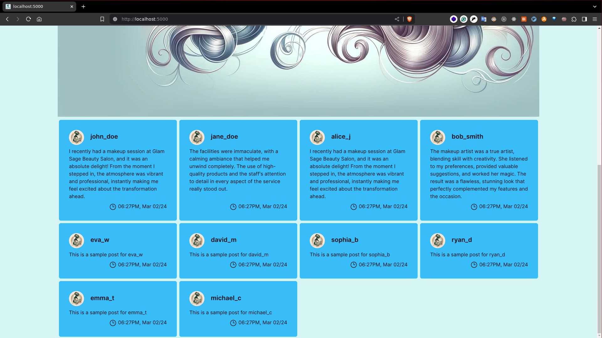

# Glamsage with glam_haven :/

## Requirements

- [ ] Python 3.10
  - [ ] pipenv(look at Pipfile)
- [ ] node/bun
  - [ ] npm(look at package.json)

## how to Run?

- [ ] compile tailwind

```sh
# tailwind using node(build once)
npm run build

# tailwind using node(watch mode if you intend to make changes)
npm run dev

```

- [ ] install python dependencies

```sh
# create new virtual environment in current directory
pipenv shell

# install dependencies
pipenv install
```

- [ ] initilize database

```sh
pipenv run python3 utils/database-init.py
```

> above command should output this

```text
admin table created
client table created
provider table created
service table created
post table created
payment table created
bkash_payment table created
review table created
review_like table created
reply table created
rating table created
report table created
notification table created
total_sale table created
```

- [ ] run the server

```sh
pipenv run python3 app.py
```

## overview





## Issue

- [ ] image uploads are not secure as all images are saved in static folder
- [ ] discount value is not calculated in a good way
- [ ] because of `paknami`, maybe login breaks(I just messed up after building working login)
- [ ] simple thing are implemented with complex way
- [ ] there is some bug in `pseudo` bkash transaction as some part of it generated by AI :(
